# 引言
一个人的力量是有限的，而以生产（而非学习）为目的任务是有截止日期的，哪怕再强大的程序员也不可能只靠自己就能在指定期限内完成项目。因此我们必须依靠团队合作，结合多个人的劳动来完成任务。
当人与人之间的合作是异步地对同一客体进行劳动时，在我看来，有两个核心的要点——“共识”和“隔离”。
## 共识
> "In collaborative arts... or virtually all arts, there\`s usually one voice ultimately.The person who is that driving force has to do one very important thing, and that is create the strategies with which everybody else can work. "

你也可以将它称之为规则、协议等，共识就是劳动中的所有主体为达成同一最终目的而创造的，所有人都知晓信息，所有人都遵守的规范。在合作开发中，它可以体现为编码规范，项目结构等。我们按照共识行事是为了所有人的劳动都能够对项目起到推进作用，且保证产出的劳动成果的一致性。那对于写代码来说，就是你不能随意地按照自己的风格去编写代码，而应该遵循团队所制定的编码规范。比如，代码的缩进风格、变量命名规则、函数的长度限制、注释的格式等。这些看似琐碎的细节，实际上是团队协作中不可或缺的部分。如果每个人都按照自己的方式去写代码，那么最终的代码库就会变得混乱不堪，难以维护和理解。当新的成员加入团队或者需要对代码进行后续的修改和扩展时，就会花费大量的时间去适应不同的代码风格，甚至可能会引入新的错误。
## 隔离
与共识不同，隔离指的是劳动中所有主体劳动成果之间的独立性和可见性。我们应当尽可能保证自己的劳动不会影响其他人已有的劳动成果，且对于每一个劳动者，我们不去关注其劳动过程和劳动成果的具体实现细节，即我们预设每个人做出的成果都是与其描述的是一致的。那对于我们合作开发来说，它可以体现在模块化的开发，以及接口的暴露上。这样，不同的开发者可以独立地开发不同的模块，而不用担心会影响到其他模块的正常运行。当一个模块出现问题时，也可以很容易地定位和修复，而不会导致整个项目的崩溃。而接口的设计也可以让我们可以只考虑如何使用功能，而不用在意如何实现功能。抽象层次就是人类在计算机领域最伟大的发明。

# 需求
我们知道，市面上的产品大多都是面向需求开发的，了解了上文后，我们还知道，其实使用现有的面向合作开发的产品实际上也是在遵循这项产品的共识和隔离属性，使用它们的目的是提高我们合作劳动的效率，如果不能实际地提高效率，那学习它们就没有意义。

因此，我们就需要对我们合作开发的需求进行分析，以便确认我们为什么需要它们，以及我们应该挑选哪些产品。


### 合作编码
#### 进度（修改）同步
那首先，我们知道，编译程序或者是解释程序，是需要所有源文件或脚本文件都存放在特定目录下，或者通过参数传入编译器、解释器或者链接器的。这些工作绝大部分现代IDE都为我们完成了，对于大部分项目来说，我们可以只考虑源文件的编写和项目目录结构的组织。
但这里就会遇到问题，如果两个或多个人同时编辑了某个源文件怎么办？那最简单的解决方法就是我们规定每个源文件都只能由同一个人负责，但这无疑是即傻瓜式又不负责任的做法，显而易见的低效，但也并非没有优点：只要项目成员不中途跳车或不负责任，那项目的维护难度就非常低（当然只是相对来说，自己的代码自己看不懂也很正常）。
那我们觉得不行啊，那要不就对每个文件打一个标记，当有人正在修改的时候就启用标记，当这个人的修改完成后就释放这个标记。这好像是解决了不能多个人修改同一个源文件的问题，但它是串行的，不够异步，这就有可能造成“线程饥饿”的问题，如果多个人都对同一个源文件有修改的需求，那可不就都在等待这个正在占用的人了吗？效率还是不够高。
那我们还可以专门设定一个人，由他来接受每个人对于同一个源文件的所有修改，并且由他结合所有的修改来设定最终的源文件，如果修改有冲突了，他还可以去找那些修改有冲突的程序员，然后商定保留哪部分修改。效果显而易见的好，成本显而易见的高——要多一个人的工资呢。那我们是不是就可以退而求其次，看看有没有软件能够替我们完成这个合并修改的工作呢？有的兄弟有的，在此先按下不表。
当然现代很多工具都已经能做到实时的同步修改了，但这一类服务的价格可能比上一种方案的那个人的工资都高。
我们以上也只是分析了合作完成这件事的需要，现实中还会涉及到计算每个人对项目的贡献量，错误代码的追责等，因此改动的简介、作者和时间信息也需要被记录下来。
#### 代码风格统一
为了我们代码的一致性、可读性和可维护性，我们需要遵循一定的编码规范，比如统一的缩进风格、变量命名规则、函数的长度限制、注释的格式等。但人是自由的，每个人的编码风格可能大相径庭，因此我们需要有一个工具来帮助我们自动化地对代码进行格式化，又或者检测代码是否符合规范。
（这个问题我不会单独介绍工具的使用方法，而是会介绍一些规范的意思）
### 版本控制
我们写代码，尤其是完成复杂的项目时，往往都不是一蹴而就的，而是经历了多次的开发迭代，可能是分模块开发，可能是按功能开发，或者为不同的客户服务而需要不同的功能集合，又或是某个功能使用不同特性的实现，又或者是在开发过程中又有了新想法，或者是项目的需求发生了变化，或者是某些改动需要舍弃并回到之前的版本，亦或是只是需要记录开发过程。
我们可以将特定的功能集合和特性集合视为一个版本，我们需要一个版本控制系统来记录每个版本的变更，以便于后续的查阅和回滚，又或者是不同版本之间功能集合和特性集合的合并和对比。
有趣的是，如果我们将合作编码中每一次的修改都视为一个版本，那么我们就可以借助版本管理工具来完成我们以上两个需求。
### 项目管理和任务分发
对于项目的管理者来说，他需要一个途径获取项目目前的进展、状态和问题，以及任务的向下分发，以保证项目对于管理者的实时性，对于开源项目来说可能任务分发没有那么重要，但对于固定团队的项目来说，任务分发就显得尤为重要，这关系到每个开发者的能力能否得到有效的发挥，以及项目的进展如何被管理者看到。
并且对于企业来说，也需要知道项目中每个成员对于该项目的贡献程度，以及记录任务的完成情况，以便于管理者对项目的整体进展和各个成员的工作情况进行评估。
对于开发者来说，我想你们在之前的工作中应该也感觉出来了，很多时候会不知道自己应该做什么，或者有了新的成果却无从汇报。
结合以上的分析，我们需要有那么一个工具，帮助我们完成项目管理和任务分发，并且能够记录每个人的贡献量，错误追责等，以便于管理者对项目的整体进展和各个成员的工作情况进行评估。
那对于我们这个项目来说，我们没有那么多复杂的需求，但是任务分发和进展的记录还是很重要的。
（那接下来也会有我来对你们进行任务的分发，你们也要及时响应才行。）
### 文档协作
写文档是开发中不得不品鉴的一环，对于一个产品来说，你需要事无巨细的把功能描述出来，对于一个代码库来说，你需要详细的记录每个模块的功能和实现，以及类型和接口的定义。并且如果有多个开发者参与开发，且可能会修改或使用同一部分代码，那么对这些代码的说明文档也是必须的。
而对于最后需要交付的文档，很多时候更像是在一起编辑同一个源文件，且大部分情况下，这个修改是同时进行的，因此能够实时看到其他人的修改的文档协作就显得尤为重要。
### 即时通讯
即时通讯我就不单独说了，这里只是列出来，提醒你们有问题或者有进度一定要及时和我说。

-------

以上为老版本讲义部分内容

-------
# Git 协作工作流及代码规范

## 为什么需要协作规范

团队合作开发时，我们需要解决两个核心问题：

1. **共识**：统一的编码规范、项目结构、工作流程，确保所有人的工作都能推进项目，且产出一致。
2. **隔离**：保证每个人的工作成果相互独立，互不干扰，通过模块化和接口设计实现并行开发。

本课程的目标是建立**可执行的团队工程操作系统**，而不仅仅是学习 Git 原理。

## 第一个共识

为了方便区分脚本和命令，我们为直接在命令行里执行的命令加上前缀：

```bash
$ <命令>
```

---

# 一、Git 基础操作

## Git 基本概念

Git 管理的目录分为三个部分：

- **工作区**：你在电脑里能看到的目录，通过命令将文件的修改添加到暂存区。
- **暂存区**（stage）：临时保存修改文件，通过命令将暂存区的记录提交到本地仓库。
- **本地仓库**（.git 目录）：保存所有版本信息，包括提交记录、版本快照等。

文件在工作区的状态有三种：

- **已修改（modified）**：文件在工作区被修改，但还没有被暂存。
- **已暂存（staged）**：文件已在暂存区，等待提交到本地仓库。
- **未跟踪（untracked）**：文件在工作区中，但并没有被纳入版本控制。

## Git 基本命令

### 初始化仓库

```bash
$ git init
```

将当前目录变成一个 Git 仓库。

### 查看状态

```bash
$ git status
```

查看当前工作区和暂存区的状态。

### 添加文件到暂存区

```bash
$ git add <文件路径>        # 添加单个文件
$ git add .                 # 添加所有修改的文件
$ git add <目录路径>         # 添加整个目录
```

### 提交到本地仓库

```bash
$ git commit -m "提交说明"
```

将暂存区的记录提交到本地仓库，并附上提交说明。

### 查看提交历史

```bash
$ git log                   # 查看提交历史
$ git log --oneline         # 简洁模式查看
$ git log --graph           # 图形化查看分支
```

### 分支操作

```bash
$ git branch                # 查看本地分支
$ git branch -r             # 查看远程分支
$ git branch -a             # 查看所有分支
$ git branch <分支名>       # 创建新分支
$ git switch <分支名>       # 切换分支（推荐）
$ git checkout <分支名>     # 切换分支（旧方式）
$ git checkout -b <分支名>  # 创建并切换到新分支
```

#### 分支创建可视化

**创建分支前**：

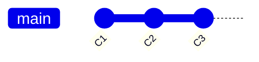

**执行 `git branch feature-a` 后**：

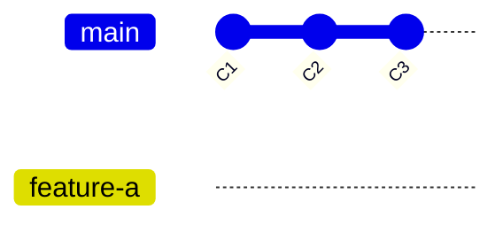

**执行 `git switch feature-a` 并提交后**：

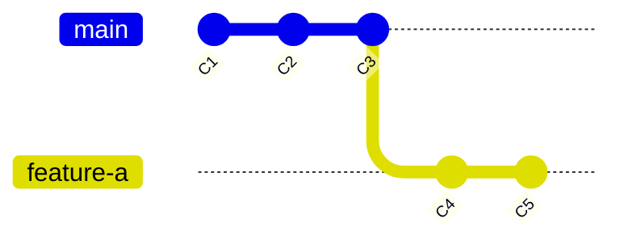

**ASCII 图表示**：

```text
创建分支前：
main:  C1 ── C2 ── C3

创建分支后（未切换）：
main:       C1 ── C2 ── C3
                      │
feature-a:            └─── (指向 C3)

切换分支并提交后：
main:       C1 ── C2 ── C3
                      │
feature-a:            └─── C4 ── C5
```

### 远程仓库操作

```bash
$ git remote -v                    # 查看远程仓库
$ git remote add <名称> <URL>      # 添加远程仓库
$ git push <远程名> <分支名>        # 推送到远程仓库
$ git pull <远程名> <分支名>       # 从远程拉取并合并
$ git fetch <远程名>               # 从远程获取更新（不合并）
```

### 恢复文件

```bash
$ git restore <文件路径>            # 恢复工作区的文件（新方式）
$ git checkout <文件路径>           # 恢复工作区的文件（旧方式）
$ git restore --staged <文件路径>  # 取消暂存
```

## Git 命令辨析：switch、checkout、restore、reset

这些命令功能有重叠，容易混淆。以下是它们的区别和用法：

### 命令功能对比

| 命令 | 主要功能 | 使用场景 |
|------|---------|---------|
| `git switch` | 切换分支 | 切换分支（推荐） |
| `git checkout` | 多用途（旧命令） | 切换分支、恢复文件、检出提交（不推荐） |
| `git restore` | 恢复文件 | 恢复工作区或暂存区的文件（推荐） |
| `git reset` | 重置提交历史 | 回退提交、移动分支指针 |

### git switch vs git checkout

#### git switch（推荐用于切换分支）

**功能**：专门用于切换分支，功能单一明确。

```bash
# 切换到已存在的分支
$ git switch <分支名>

# 创建新分支并切换
$ git switch -c <分支名>
# 或
$ git switch --create <分支名>

# 基于指定提交创建分支并切换
$ git switch -c <分支名> <提交哈希>
```

**特点**：
- ✅ 功能单一，只用于分支切换
- ✅ 如果工作区有未提交的更改，会要求先提交或 stash
- ✅ 更安全，不会意外覆盖文件

#### git checkout（旧方式，功能混杂）

**功能**：多用途命令，可以切换分支、恢复文件、检出提交等。

```bash
# 切换分支（旧方式）
$ git checkout <分支名>

# 创建并切换分支
$ git checkout -b <分支名>

# 恢复文件（旧方式，不推荐）
$ git checkout <文件路径>

# 检出特定提交（进入 detached HEAD 状态）
$ git checkout <提交哈希>
```

**特点**：
- ⚠️ 功能混杂，容易误用
- ⚠️ 恢复文件时会直接覆盖，可能丢失更改
- ⚠️ 新版本 Git 推荐使用更专门的命令

**为什么推荐使用 `git switch`**：
- `git checkout` 承载了太多功能，容易混淆
- `git switch` 专门用于分支切换，更直观
- 如果工作区有未提交更改，`git switch` 会提示，更安全

### git restore vs git checkout（恢复文件）

#### git restore（推荐用于恢复文件）

**功能**：专门用于恢复工作区或暂存区的文件。

```bash
# 恢复工作区的文件（丢弃工作区的更改）
$ git restore <文件路径>

# 恢复暂存区的文件（取消暂存，但保留工作区更改）
$ git restore --staged <文件路径>

# 同时恢复工作区和暂存区
$ git restore --staged --worktree <文件路径>
```

**特点**：
- ✅ 功能明确，专门用于文件恢复
- ✅ 命令语义清晰（restore = 恢复）
- ✅ 可以分别操作工作区和暂存区

#### git checkout（旧方式，不推荐）

```bash
# 恢复工作区的文件（旧方式）
$ git checkout <文件路径>

# 恢复工作区的所有文件
$ git checkout .
```

**为什么不推荐**：
- `checkout` 功能太多，容易误操作
- 恢复文件时可能意外切换分支
- `restore` 更明确、更安全

### git reset（重置提交历史）

**功能**：移动当前分支指针，可以回退提交历史。

```bash
# 软重置：移动指针，保留更改在暂存区
$ git reset --soft <提交哈希>

# 混合重置（默认）：移动指针，保留更改在工作区
$ git reset --mixed <提交哈希>
$ git reset <提交哈希>

# 硬重置：移动指针，丢弃所有更改（危险！）
$ git reset --hard <提交哈希>

# 重置到上一个提交
$ git reset HEAD~1
```

**特点**：
- ⚠️ 会改变提交历史
- ⚠️ `--hard` 会丢失未提交的更改（危险）
- ✅ 用于撤销提交、整理历史

**与 restore 的区别**：
- `git restore`：恢复文件，不改变提交历史
- `git reset`：移动分支指针，改变提交历史

### 使用场景总结

#### 场景 1：切换分支

```bash
# ✅ 推荐
$ git switch dev

# ⚠️ 旧方式（仍可用，但不推荐）
$ git checkout dev
```

#### 场景 2：恢复工作区的文件

```bash
# ✅ 推荐
$ git restore src/main.rs

# ⚠️ 旧方式（不推荐）
$ git checkout src/main.rs
```

#### 场景 3：取消暂存

```bash
# ✅ 推荐
$ git restore --staged src/main.rs

# 旧方式（不推荐）
$ git reset HEAD src/main.rs
```

#### 场景 4：回退提交

```bash
# 使用 reset（这是 reset 的专长）
$ git reset --soft HEAD~1  # 保留更改在暂存区
$ git reset HEAD~1          # 保留更改在工作区
$ git reset --hard HEAD~1   # 丢弃所有更改（危险！）
```

### 命令选择决策树

```
需要做什么？
│
├─ 切换分支？
│   └─ ✅ 使用 git switch
│
├─ 恢复文件？
│   ├─ 恢复工作区？
│   │   └─ ✅ 使用 git restore <文件>
│   │
│   └─ 取消暂存？
│       └─ ✅ 使用 git restore --staged <文件>
│
└─ 回退提交？
    └─ ✅ 使用 git reset
```

### 记忆技巧

1. **switch = 切换**：专门用于切换分支
2. **restore = 恢复**：专门用于恢复文件
3. **reset = 重置**：专门用于重置提交历史
4. **checkout = 旧命令**：功能太多，新版本中不推荐使用

### 最佳实践

1. **切换分支**：使用 `git switch`
2. **恢复文件**：使用 `git restore`
3. **回退提交**：使用 `git reset`
4. **避免使用**：`git checkout` 用于切换分支或恢复文件（除非必须兼容旧版本）

---

## Git 进阶操作

### git stash（临时保存工作进度）

`git stash` 是 Git 原生的临时保存工作进度的功能。当你正在开发中，需要临时切换分支或处理其他任务时，可以使用 `stash` 来快速保存当前未完成的工作，而无需创建提交。

#### 基本概念

Stash 会将当前工作区和暂存区的更改保存到一个临时区域，让你的工作目录变干净，可以安全地切换分支。之后可以随时恢复这些更改。

#### git stash 使用场景

**保存当前工作进度**：

```bash
# 保存当前所有更改（包括已暂存和未暂存的）
$ git stash

# 或者添加说明信息
$ git stash save "临时保存，准备切换分支"

# 只保存已暂存的文件（不包括未跟踪的文件）
$ git stash --keep-index

# 包括未跟踪的文件
$ git stash -u
# 或
$ git stash --include-untracked
```

**查看 stash 列表**：

```bash
# 查看所有保存的 stash
$ git stash list

# 输出示例：
# stash@{0}: WIP on dev: abc1234 [feat/log] 添加日志功能
# stash@{1}: On feature-a: def5678 临时保存，准备切换分支
```

**恢复 stash**：

```bash
# 恢复最近的 stash 并删除它（推荐）
$ git stash pop

# 恢复最近的 stash 但不删除
$ git stash apply

# 恢复指定的 stash
$ git stash pop stash@{1}
$ git stash apply stash@{1}
```

**删除 stash**：

```bash
# 删除最近的 stash
$ git stash drop

# 删除指定的 stash
$ git stash drop stash@{1}

# 清空所有 stash
$ git stash clear
```

**查看 stash 内容**：

```bash
# 查看最近的 stash 的更改内容
$ git stash show

# 查看详细的更改内容
$ git stash show -p

# 查看指定 stash 的内容
$ git stash show stash@{1}
$ git stash show -p stash@{1}
```

#### 完整示例

```bash
# 场景：正在 feature-a 分支上开发，需要临时切换到 dev 分支

# 1. 查看当前状态
$ git status
# 有一些未提交的更改

# 2. 保存当前工作进度
$ git stash save "临时保存 feature-a 的工作"

# 3. 确认工作区已干净
$ git status
# 工作区干净，可以切换分支

# 4. 切换到其他分支
$ git switch dev

# 5. 在其他分支上工作...

# 6. 切换回 feature-a 分支
$ git switch feature-a

# 7. 恢复之前保存的工作
$ git stash pop

# 8. 继续开发
```

#### 高级用法

**创建分支并应用 stash**：

```bash
# 从 stash 创建一个新分支
$ git stash branch <分支名>

# 这会：
# 1. 创建一个新分支
# 2. 切换到新分支
# 3. 应用 stash
# 4. 删除 stash（如果成功应用）
```

**部分文件 stash**：

```bash
# 只 stash 指定的文件
$ git stash push <文件路径1> <文件路径2>

# 示例
$ git stash push src/main.rs src/utils.rs
```

#### 注意事项

- **Stash 是本地操作**：`git stash` 不会推送到远程仓库，只保存在本地
- **Stash 可以多次保存**：可以保存多个 stash，通过 `stash@{n}` 访问
- **未跟踪的文件**：默认情况下，`git stash` 不会保存未跟踪的文件，需要使用 `-u` 选项
- **冲突处理**：如果恢复 stash 时出现冲突，需要手动解决冲突，然后使用 `git stash drop` 删除 stash
- **及时清理**：不需要的 stash 应该及时删除，避免混淆

#### 最佳实践

1. **添加说明信息**：使用 `git stash save "说明"` 让 stash 更有意义
2. **及时恢复**：完成其他任务后，尽快恢复 stash 继续工作
3. **定期清理**：使用 `git stash list` 查看，删除不需要的 stash
4. **配合 worktree**：在切换工作树前使用 `git stash` 保存进度

### git worktree

`git worktree` 允许你在同一个仓库中同时检出多个工作树（工作目录），这对于需要在不同分支上同时工作非常有用。

#### 基本概念

传统方式下，一个 Git 仓库只能有一个工作目录。使用 `git worktree` 后，你可以在同一个仓库中创建多个工作目录，每个目录可以检出不同的分支，互不干扰。

#### git worktree 使用场景

- **同时开发多个功能**：在 `feature-a` 上开发时，需要切换到 `feature-b` 进行调试
- **并行测试**：在一个工作树中运行测试，另一个工作树中继续开发
- **代码审查**：在一个工作树中查看其他分支的代码，另一个工作树中继续工作

#### 基本命令

**创建新的工作树**：

```bash
# 在指定路径创建新的工作树，并检出指定分支
$ git worktree add <路径> <分支名>

# 示例：在 ../wateros-feature-b 创建新工作树，检出 feature-b 分支
$ git worktree add ../wateros-feature-b feature-b

# 如果分支不存在，可以创建新分支
$ git worktree add ../wateros-feature-b -b feature-b
```

**列出所有工作树**：

```bash
$ git worktree list
```

输出示例：

```text
/path/to/main-repo        abc1234 [dev]
/path/to/wateros-feature-b def5678 [feature-b]
```

**切换到工作树**：

```bash
# 直接进入工作树目录
$ cd ../wateros-feature-b

# 在该目录中正常使用 git 命令
$ git status
$ git switch feature-b
```

**删除工作树**：

```bash
# 删除工作树（需要先删除工作树目录）
$ rm -rf ../wateros-feature-b
$ git worktree remove ../wateros-feature-b

# 或者使用 prune 自动清理无效的工作树
$ git worktree prune
```

**锁定和解锁工作树**：

```bash
# 锁定工作树（防止意外修改，比如在移动硬盘上）
$ git worktree lock ../wateros-feature-b

# 解锁工作树
$ git worktree unlock ../wateros-feature-b
```

#### 完整示例

```bash
# 1. 在主仓库中，当前在 feature-a 分支上工作
$ git status
# 有一些未提交的更改

# 2. 使用 stash 保存当前进度
$ git stash save "临时保存 feature-a 的工作"

# 3. 创建新的工作树用于 feature-b
$ git worktree add ../wateros-feature-b feature-b

# 4. 切换到新工作树
$ cd ../wateros-feature-b

# 5. 在新工作树中工作
$ git switch feature-b
# 进行开发...

# 6. 回到主工作树
$ cd ../wateros-main

# 7. 恢复之前保存的工作
$ git stash pop

# 8. 继续在 feature-a 上工作
```

#### 注意事项

- **工作树路径不能是子目录**：新工作树必须位于仓库外部
- **分支唯一性**：同一个分支不能同时在多个工作树中检出
- **共享 .git 目录**：所有工作树共享同一个 `.git` 目录，所以提交、分支等信息是共享的
- **清理工作树**：删除工作树目录后，记得使用 `git worktree remove` 或 `git worktree prune` 清理

#### 最佳实践

1. **使用有意义的路径名**：如 `../wateros-feature-b` 而不是 `../temp`
2. **及时清理**：不需要的工作树及时删除，避免占用空间
3. **配合 stash 使用**：在切换工作树前使用 `git stash` 保存进度
4. **避免冲突**：确保不同工作树中的分支不会产生冲突

### git cherry-pick

`git cherry-pick` 允许你选择性地将某个提交应用到当前分支，而不需要合并整个分支。这对于需要将某个 bug 修复或功能从其他分支单独移植过来非常有用。

#### 基本概念

Cherry-pick 会创建一个新的提交，这个提交的内容与指定的提交相同，但具有不同的提交哈希值。这意味着你可以在不同的分支上应用相同的更改。

#### Cherry-pick 操作可视化

**Cherry-pick 前状态**：

```mermaid
gitGraph
    commit id: "C1"
    commit id: "C2"
    branch feature-a
    checkout feature-a
    commit id: "C3"
    commit id: "C4: [fix/mm] 修复bug"
    commit id: "C5"
    checkout dev
    commit id: "C6"
    commit id: "C7"
```

**ASCII 图**：

```text
feature-a:  C1 ── C2 ── C3 ── C4 ── C5
                                    │
dev:        C1 ── C2 ── C6 ── C7    │
                                    │
                             (需要 cherry-pick C4)
```

**执行 Cherry-pick 后**：

```bash
$ git switch dev
$ git cherry-pick C4
```

**Cherry-pick 后的状态**：

```mermaid
gitGraph
    commit id: "C1"
    commit id: "C2"
    branch feature-a
    checkout feature-a
    commit id: "C3"
    commit id: "C4: [fix/mm] 修复bug"
    commit id: "C5"
    checkout dev
    commit id: "C6"
    commit id: "C7"
    commit id: "C4': [fix/mm] 修复bug"
```

**ASCII 图**：

```text
feature-a:  C1 ── C2 ── C3 ── C4 ── C5

dev:        C1 ── C2 ── C6 ── C7 ── C4'
                                    │
                             (新提交，内容与 C4 相同)
```

**说明**：
- C4' 是新的提交，内容与 C4 完全相同
- C4' 的哈希值与 C4 不同（因为父提交不同）
- feature-a 分支保持不变
- 只应用了 C4，没有应用 C3 和 C5

#### 使用场景

- **移植 bug 修复**：将 `dev` 分支上的 bug 修复应用到 `main` 分支，而不需要合并整个 `dev` 分支
- **选择性应用功能**：从某个功能分支中选择性地应用某些提交
- **跨分支同步**：将某个重要的提交同步到多个分支

#### 基本命令

**Cherry-pick 单个提交**：

```bash
# 切换到目标分支
$ git switch dev

# Cherry-pick 指定的提交（使用提交哈希）
$ git cherry-pick <commit-hash>

# 示例：应用 feature-a 分支上的某个提交
$ git cherry-pick abc1234
```

**Cherry-pick 多个提交**：

```bash
# Cherry-pick 多个提交（按顺序应用）
$ git cherry-pick <commit1> <commit2> <commit3>

# Cherry-pick 一个范围的提交（不包含起始提交）
$ git cherry-pick <start-commit>..<end-commit>

# Cherry-pick 一个范围的提交（包含起始提交）
$ git cherry-pick <start-commit>^..<end-commit>
```

#### Cherry-pick 多个提交可视化

**Cherry-pick 前**：

```mermaid
gitGraph
    commit id: "C1"
    commit id: "C2"
    branch feature-a
    checkout feature-a
    commit id: "C3"
    commit id: "C4: [fix/mm] 修复bug1"
    commit id: "C5: [fix/mm] 修复bug2"
    commit id: "C6"
    checkout dev
    commit id: "C7"
```

**执行 `git cherry-pick C4 C5` 后**：

```mermaid
gitGraph
    commit id: "C1"
    commit id: "C2"
    branch feature-a
    checkout feature-a
    commit id: "C3"
    commit id: "C4: [fix/mm] 修复bug1"
    commit id: "C5: [fix/mm] 修复bug2"
    commit id: "C6"
    checkout dev
    commit id: "C7"
    commit id: "C4': [fix/mm] 修复bug1"
    commit id: "C5': [fix/mm] 修复bug2"
```

**ASCII 图**：

```text
feature-a:  C1 ── C2 ── C3 ── C4 ── C5 ── C6

dev:        C1 ── C2 ── C7 ── C4' ── C5'
                                    │    │
                             (按顺序应用)
```

**查看提交哈希**：

```bash
# 查看提交历史，获取提交哈希
$ git log --oneline

# 查看其他分支的提交历史
$ git log --oneline feature-a
```

#### 处理冲突

如果 cherry-pick 过程中出现冲突：

```bash
# 1. 查看冲突文件
$ git status

# 2. 手动解决冲突（编辑冲突文件）

# 3. 标记冲突已解决
$ git add <冲突文件>

# 4. 继续 cherry-pick
$ git cherry-pick --continue

# 或者放弃 cherry-pick
$ git cherry-pick --abort
```

#### 完整示例

```bash
# 场景：需要将 feature-a 分支上的 bug 修复应用到 dev 分支

# 1. 查看 feature-a 分支的提交历史
$ git log --oneline feature-a
# 输出：
# def5678 [fix/mm] 修复内存泄漏问题
# abc1234 [feat/mm] 添加新功能
# ...

# 2. 切换到 dev 分支
$ git switch dev

# 3. Cherry-pick bug 修复提交
$ git cherry-pick def5678

# 4. 如果成功，提交会自动应用到 dev 分支
# 如果出现冲突，按照上述步骤解决冲突
```

**完整示例可视化**：

**操作前**：

```mermaid
gitGraph
    commit id: "C1"
    commit id: "C2"
    branch feature-a
    checkout feature-a
    commit id: "abc1234: [feat/mm] 添加新功能"
    commit id: "def5678: [fix/mm] 修复内存泄漏"
    checkout dev
    commit id: "C3"
    commit id: "C4"
```

**执行 `git cherry-pick def5678` 后**：

```mermaid
gitGraph
    commit id: "C1"
    commit id: "C2"
    branch feature-a
    checkout feature-a
    commit id: "abc1234: [feat/mm] 添加新功能"
    commit id: "def5678: [fix/mm] 修复内存泄漏"
    checkout dev
    commit id: "C3"
    commit id: "C4"
    commit id: "def5678': [fix/mm] 修复内存泄漏"
```

**ASCII 图**：

```text
操作前：
feature-a:  C1 ── C2 ── abc1234 ── def5678
                                    │
dev:        C1 ── C2 ── C3 ── C4    │
                                    │
                             (需要 cherry-pick)

操作后：
feature-a:  C1 ── C2 ── abc1234 ── def5678

dev:        C1 ── C2 ── C3 ── C4 ── def5678'
                                    │
                             (只应用了 bug 修复)
```

#### 高级用法

**Cherry-pick 但不自动提交**：

```bash
# 只应用更改到工作区，不自动提交
$ git cherry-pick -n <commit-hash>
# 或
$ git cherry-pick --no-commit <commit-hash>

# 然后可以手动修改后再提交
$ git commit -m "[fix/mm] 修复内存泄漏问题（从 feature-a 移植）"
```

**Cherry-pick 并编辑提交信息**：

```bash
# 应用提交并允许编辑提交信息
$ git cherry-pick -e <commit-hash>
# 或
$ git cherry-pick --edit <commit-hash>
```

**查看将要 cherry-pick 的内容**：

```bash
# 查看提交的更改内容（不实际应用）
$ git show <commit-hash>
```

#### 注意事项

- **提交哈希唯一性**：Cherry-pick 会创建新的提交，即使内容相同，哈希值也不同
- **依赖关系**：如果提交依赖于其他提交，可能需要 cherry-pick 多个提交
- **冲突处理**：Cherry-pick 可能产生冲突，需要手动解决
- **避免重复**：如果提交已经存在于目标分支，cherry-pick 可能会失败或产生空提交

#### 最佳实践

1. **先查看提交内容**：使用 `git show` 查看提交的更改，确认是否需要 cherry-pick
2. **保持提交信息清晰**：Cherry-pick 后可以编辑提交信息，说明来源
3. **处理依赖关系**：如果提交有依赖，需要按顺序 cherry-pick 多个提交
4. **测试验证**：Cherry-pick 后务必测试，确保功能正常

> **学习建议**：Git 的原理和高级用法建议通过 [Learn Git Branching](https://learngitbranching.js.org/?locale=zh_CN) 进行可视化学习，完成"主要"部分的"基础篇"、"高级篇"和"远程"部分的所有关卡。

---

# 二、分支模型定义

## 分支结构

我们采用以下分支模型：

- **`main`**：主分支，始终可运行，**禁止直接提交**
- **`dev`**：日常集成分支，所有功能开发完成后合并到这里
- **`feature/<name>`**：功能开发分支，从 `dev` 创建，开发完成后合并回 `dev`

## 分支模型图示

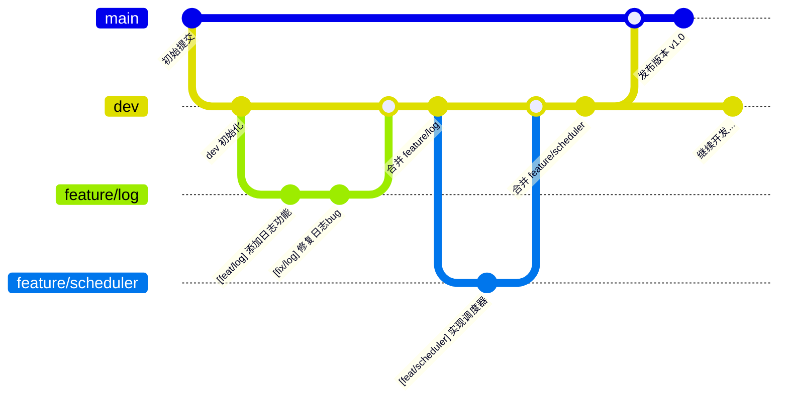

## 协作流程

```text
feature/<name> → dev → main
```

所有功能开发都在 `feature` 分支上进行，完成后通过 Pull Request 合并到 `dev`，`dev` 经过测试后合并到 `main`。

### 流程说明

1. **创建功能分支**：从 `dev` 分支创建 `feature/<name>` 分支
2. **功能开发**：在 `feature` 分支上进行开发和提交
3. **合并到 dev**：通过 Pull Request 将 `feature` 分支合并到 `dev`
4. **测试验证**：在 `dev` 分支上进行集成测试
5. **发布到 main**：测试通过后，将 `dev` 合并到 `main` 分支发布

### 分支关系图（ASCII 图）

```
main    ●─────────────────────────────●───────────────●
         │                             │               │
         │                             │               │
dev      └───●─────────●───────────────┴───●───────────┘
             │         │                   │
             │         │                   │
feature/log  └───●─────┘                   │
                 │                          │
feature/scheduler└──────────────────────────┘
```

**图例说明**：
- `●` 表示提交点
- 实线表示分支和合并关系
- 箭头方向表示合并方向（feature → dev → main）

---

# 三、标准开发流程

## 完整开发流程演示

以下是一个完整的开发流程示例：

### 1. 每日开发前同步

```bash
# 切换到开发分支
$ git switch dev

# 拉取最新代码
$ git pull origin dev
```

### 2. 创建功能分支

```bash
# 确保在 dev 分支上
$ git switch dev

# 拉取最新代码
$ git pull origin dev

# 创建并切换到新功能分支
$ git checkout -b feature/log
```

### 3. 开发代码

进行代码修改、编写、测试等开发工作。

### 4. 代码格式化与检查（Rust 项目）

```bash
# 格式化代码
$ cargo fmt

# 静态检查
$ cargo clippy -- -D warnings

# 编译检查
$ cargo build
```

### 5. 提交代码

```bash
# 查看修改状态
$ git status

# 添加修改的文件
$ git add .

# 提交（使用规范的提交信息格式）
$ git commit -m "[feat/log] add basic logging support"

# 推送到远程仓库
$ git push origin feature/log
```

### 6. 创建 Pull Request

在 GitHub 网页上创建 Pull Request，详细步骤请参考"五、Pull Request 规范"中的"GitHub 上创建 Pull Request 的详细流程"部分。

简要步骤：

1. 进入仓库页面
2. 点击 "Pull requests" → "New pull request"
3. 选择 `feature/log` → `dev`（compare → base）
4. 填写 PR 标题和描述（参考 PR 规范）
5. 点击 "Create pull request"
6. 等待代码审查
7. 审查通过后合并 PR

### 7. PR 合并后清理

```bash
# 切换回 dev 分支
$ git switch dev

# 拉取最新代码（包含你的 PR）
$ git pull origin dev

# 删除本地功能分支
$ git branch -d feature/log

# 删除远程功能分支（如果已合并）
$ git push origin --delete feature/log
```

---

# 四、提交信息规范

## 格式要求

所有提交信息必须遵循以下格式：

```text
[<type>/(m)] <description>
```

### 类型（type）限定

- **`feat`**：新功能
- **`fix`**：修复 bug
- **`refactor`**：重构代码
- **`docs`**：文档更新
- **`test`**：测试相关
- **`chore`**：构建过程或辅助工具的变动

### 作用域（m）

可选，表示修改的模块，如：`mm`（内存管理）、`trap`（异常处理）、`scheduler`（调度器）等。

### 描述（description）

简洁明了地描述本次提交的内容。

## 提交信息示例

```bash
$ git commit -m "[feat/mm] implement frame allocator"
$ git commit -m "[fix/trap] correct syscall return value"
$ git commit -m "[docs/readme] update build instructions"
$ git commit -m "[refactor/scheduler] optimize round-robin algorithm"
$ git commit -m "[test/mm] add frame allocator unit tests"
$ git commit -m "[chore] update dependencies"
```

## 关联 Issue

如果提交解决了某个 Issue，在描述中关联：

```bash
$ git commit -m "[feat/task] add simple executor (#12)"
```

---

# 五、Pull Request 规范

## GitHub 上创建 Pull Request 的详细流程

### 前置条件

在创建 PR 之前，确保你已经：

1. ✅ 完成了功能开发并提交到本地仓库
2. ✅ 将功能分支推送到远程仓库
3. ✅ 代码已通过格式化和静态检查（`cargo fmt`、`cargo clippy`）

### 步骤一：推送功能分支到远程

```bash
# 确保在功能分支上
$ git switch feature/log

# 推送到远程仓库
$ git push origin feature/log
```

### 步骤二：在 GitHub 上创建 Pull Request

#### 方法一：通过仓库页面创建

1. **进入 GitHub 仓库页面**
   - 打开你的 GitHub 仓库（或 Fork 的仓库）
   - 确保你在正确的仓库中

2. **点击 "Pull requests" 标签**
   - 在仓库页面顶部，点击 "Pull requests" 标签
   - 或者直接访问：`https://github.com/用户名/仓库名/pulls`

3. **点击 "New pull request" 按钮**
   - 在 Pull requests 页面，点击右上角的绿色 "New pull request" 按钮

4. **选择源分支和目标分支**
   - **base 分支**（目标分支）：选择 `dev`（这是要合并到的分支）
   - **compare 分支**（源分支）：选择 `feature/log`（这是你的功能分支）
   - GitHub 会自动显示两个分支之间的差异

5. **查看更改内容**
   - GitHub 会显示：
     - 文件更改列表
     - 新增/删除的行数统计
     - 每个文件的详细差异（diff）
   - 仔细检查确保所有更改都是预期的

6. **填写 PR 标题和描述**
   - **标题**：简洁明了，例如：`[feat/log] 添加基础日志系统`
   - **描述**：按照下面的 PR 模板填写详细内容

7. **添加审查者（可选）**
   - 在右侧 "Reviewers" 部分，可以 @ 团队成员进行代码审查
   - 例如：`@username` 来通知特定成员

8. **关联 Issue（如果有）**
   - 在描述中使用 `fixes #12` 或 `closes #12` 来关联 Issue
   - GitHub 会自动识别并在 PR 合并时关闭对应的 Issue

9. **点击 "Create pull request"**
   - 确认所有信息无误后，点击绿色的 "Create pull request" 按钮

#### 方法二：通过分支提示创建

1. **推送分支后，GitHub 会显示提示**
   - 在仓库主页，GitHub 会显示一个黄色提示框
   - 内容类似："feature/log had recent pushes X minutes ago"
   - 点击 "Compare & pull request" 按钮

2. **后续步骤同方法一的步骤 4-9**

### 步骤三：等待代码审查

创建 PR 后：

1. **等待审查**
   - 团队成员会收到通知
   - 审查者会查看代码并提出意见

2. **处理审查意见**
   - 如果审查者提出修改建议：
     ```bash
     # 在本地修改代码
     $ git add .
     $ git commit -m "[fix/log] 根据审查意见修改"
     $ git push origin feature/log
     ```
   - PR 会自动更新，无需重新创建

3. **回复审查意见**
   - 在 PR 页面的评论中回复审查者
   - 说明已修改或解释为什么不需要修改

### 步骤四：解决冲突（如果有）

如果 PR 创建后，目标分支（`dev`）有了新的提交，可能会产生冲突：

1. **GitHub 会显示冲突提示**
   - PR 页面会显示 "This branch has conflicts that must be resolved"

2. **在本地解决冲突**
   ```bash
   # 切换到功能分支
   $ git switch feature/log
   
   # 拉取最新的 dev 分支
   $ git fetch origin dev
   
   # 合并 dev 到功能分支
   $ git merge origin/dev
   
   # 解决冲突（参考"六、冲突处理流程"）
   # ... 解决冲突 ...
   
   # 提交解决冲突的更改
   $ git add .
   $ git commit -m "[fix] 解决合并冲突"
   
   # 推送到远程
   $ git push origin feature/log
   ```

3. **GitHub 会自动更新 PR**
   - 冲突解决后，PR 状态会自动更新

### 步骤五：合并 Pull Request

当代码审查通过后：

1. **点击 "Merge pull request"**
   - 在 PR 页面底部，点击绿色的 "Merge pull request" 按钮

2. **选择合并方式**
   - **Create a merge commit**（推荐）：保留完整的合并历史
   - **Squash and merge**：将多个提交合并为一个
   - **Rebase and merge**：线性历史，不创建合并提交

3. **确认合并**
   - 点击 "Confirm merge" 确认

4. **删除分支（可选）**
   - 合并后，GitHub 会提示删除源分支
   - 点击 "Delete branch" 删除远程分支

### 步骤六：本地清理

PR 合并后，在本地清理：

```bash
# 切换回 dev 分支
$ git switch dev

# 拉取最新代码（包含你的 PR）
$ git pull origin dev

# 删除本地功能分支
$ git branch -d feature/log

# 删除远程功能分支（如果还没删除）
$ git push origin --delete feature/log
```

## PR 必须包含的内容

创建 Pull Request 时，必须包含以下信息：

1. **修改内容概述**：简要说明本次 PR 做了什么
2. **修改原因**：为什么需要这个修改
3. **是否影响其他模块**：说明是否会影响其他部分的代码
4. **是否通过测试**：是否已经测试过，测试结果如何
5. **是否包含 unsafe**：如果使用了 `unsafe`，必须说明安全性理由

## PR 规模要求

- **不超过 500 行**：保持 PR 规模适中，便于审查
- **单一功能点**：一个 PR 只做一件事
- **禁止混合多个模块重构**：不同模块的修改应该分开提交

## PR 模板示例

```markdown
## 修改内容
- 实现了基础的日志系统
- 添加了日志级别控制

## 修改原因
需要统一的日志输出接口，便于调试和问题追踪。

## 影响范围
- 新增 `log` 模块
- 不影响其他模块

## 测试情况
- [x] 通过 `cargo test`
- [x] 手动测试日志输出正常

## Unsafe 使用
无
```

## PR 页面常用功能

### 查看文件更改

在 PR 页面中，你可以：

1. **查看文件列表**
   - "Files changed" 标签显示所有更改的文件
   - 每个文件显示新增/删除的行数

2. **查看代码差异**
   - 绿色背景：新增的代码
   - 红色背景：删除的代码
   - 点击行号可以添加评论

3. **查看整个文件**
   - 点击文件名可以查看完整文件内容
   - 方便理解代码上下文

### 添加评论和审查

1. **行内评论**
   - 将鼠标悬停在代码行左侧，点击 `+` 号
   - 可以针对特定代码行添加评论
   - 评论会显示在代码审查中

2. **整体评论**
   - 在 PR 页面底部的评论框添加
   - 用于整体性的讨论和建议

3. **审查操作**
   - **Approve**：批准 PR，表示代码审查通过
   - **Request changes**：要求修改，PR 需要更新后才能合并
   - **Comment**：仅添加评论，不阻止合并

### PR 状态说明

- **Open**：PR 已创建，等待审查或合并
- **Draft**：草稿状态，表示还在开发中，不会触发审查通知
- **Closed**：PR 已关闭（可能被拒绝或取消）
- **Merged**：PR 已成功合并

### 将 PR 标记为草稿

如果功能还未完成，可以创建草稿 PR：

1. 在创建 PR 时，点击 "Create draft pull request"
2. 或者创建后，在 PR 页面点击 "Convert to draft"
3. 完成后，点击 "Ready for review" 转为正式 PR

### 更新 PR

如果需要在 PR 中添加更多更改：

```bash
# 在功能分支上继续开发
$ git switch feature/log

# 添加新的提交
$ git add .
$ git commit -m "[feat/log] 添加更多功能"
$ git push origin feature/log
```

PR 会自动更新，无需重新创建。

### 关闭 PR

如果需要取消 PR：

1. 在 PR 页面，滚动到底部
2. 点击 "Close pull request" 按钮
3. PR 会被关闭但不会删除，可以随时重新打开

---

# 六、冲突处理流程

## Merge 操作可视化

### Merge 前状态

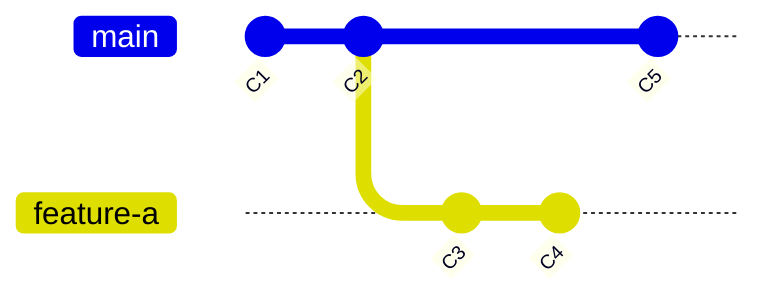

**ASCII 图**：

```text
main:       C1 ── C2 ── C5
                │
feature-a:      └─── C3 ── C4
```

### 执行 Merge 后

```bash
$ git switch main
$ git merge feature-a
```

**Merge 后的状态**：

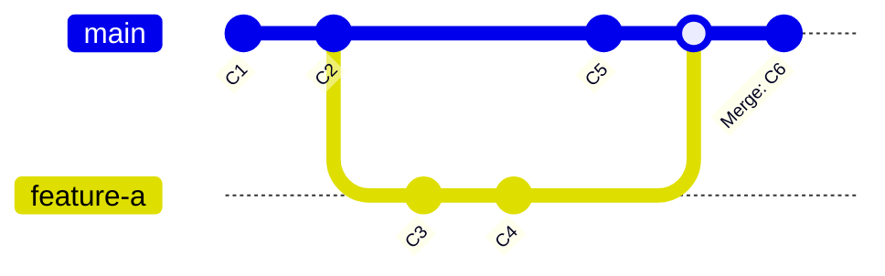

**ASCII 图**：

```text
main:       C1 ── C2 ── C5 ── C6 (merge commit)
                │              │
feature-a:      └─── C3 ── C4 ─┘
```

**说明**：
- Merge 会创建一个新的合并提交（C6）
- 这个提交有两个父提交：C5 和 C4
- feature-a 分支的历史保持不变

## 拉取时出现冲突

当执行 `git pull` 时，如果出现冲突：

```bash
$ git pull origin dev
```

如果提示冲突，Git 会显示类似信息：

```text
Auto-merging src/main.rs
CONFLICT (content): Merge conflict in src/main.rs
```

### 冲突状态可视化

**冲突发生时的状态**：

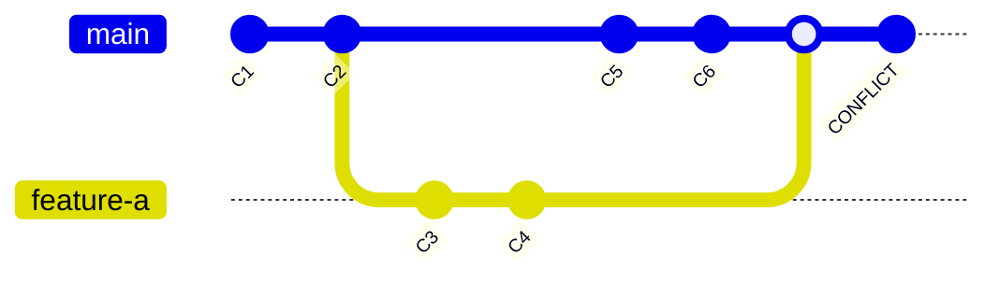

**ASCII 图**：

```text
main:       C1 ── C2 ── C5 ── C6
                │              │
feature-a:      └─── C3 ── C4 ─┘
                              │
                         (冲突状态)
```

**解决冲突后**：

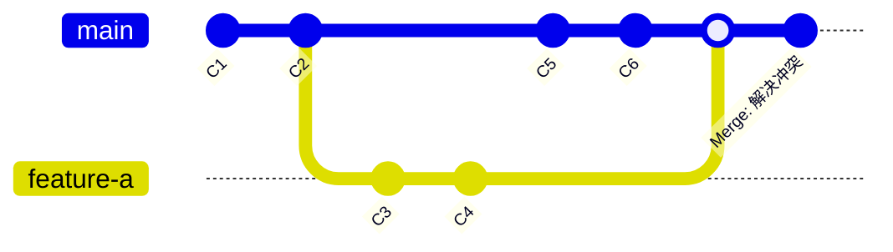

**ASCII 图**：

```text
main:       C1 ── C2 ── C5 ── C6 ── C7 (merge commit)
                │              │      │
feature-a:      └─── C3 ── C4 ───────┘
```

## 解决冲突步骤

### 1. 查看冲突文件

```bash
$ git status
```

会显示哪些文件有冲突。

### 2. 手动修改冲突文件

打开冲突文件，你会看到类似这样的标记：

```rust
<<<<<<< HEAD
// 当前分支的代码
let x = 1;
=======
// 要合并的分支的代码
let x = 2;
>>>>>>> feature-branch
```

你需要：
1. 删除冲突标记（`<<<<<<<`、`=======`、`>>>>>>>`）
2. 保留正确的代码（或合并两部分代码）
3. 确保代码逻辑正确

### 3. 标记冲突已解决

```bash
# 添加已解决冲突的文件
$ git add <文件路径>

# 完成合并提交
$ git commit
```

Git 会自动生成合并提交信息，你也可以修改。

### 4. 推送合并结果

```bash
$ git push origin <分支名>
```

## 重要规则

- **禁止使用 `git push -f` 覆盖公共分支**（`main`、`dev`）
- 如果误操作强制推送，**立即通知团队**
- 解决冲突时，如果不确定，**先询问团队成员**

---

# 七、Rebase 使用规范

## Rebase 操作可视化

### Rebase 前状态

```mermaid
gitGraph
    commit id: "C1"
    commit id: "C2"
    branch feature-a
    checkout feature-a
    commit id: "C3"
    commit id: "C4"
    checkout dev
    commit id: "C5"
    commit id: "C6"
```

**ASCII 图**：

```text
dev:        C1 ── C2 ── C5 ── C6
                │
feature-a:      └─── C3 ── C4
```

### 执行 Rebase 后

```bash
$ git switch feature-a
$ git rebase dev
```

**Rebase 后的状态**：

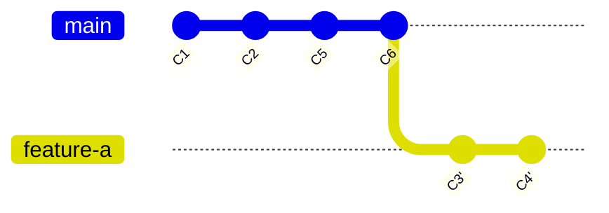

**ASCII 图**：

```text
dev:        C1 ── C2 ── C5 ── C6
                                    │
feature-a:                          └─── C3' ── C4'
```

**说明**：
- Rebase 会将 feature-a 的提交（C3, C4）重新应用到 dev 的最新提交（C6）之上
- 创建新的提交（C3', C4'），内容相同但哈希值不同
- 原来的提交（C3, C4）会被丢弃（如果分支没有推送到远程）
- **历史变成线性**，没有合并提交

### Merge vs Rebase 对比

**Merge 方式**（保留分支历史）：

```mermaid
gitGraph
    commit id: "C1"
    commit id: "C2"
    branch feature-a
    checkout feature-a
    commit id: "C3"
    commit id: "C4"
    checkout dev
    commit id: "C5"
    merge feature-a
    commit id: "Merge"
```

**Rebase 方式**（线性历史）：

```mermaid
gitGraph
    commit id: "C1"
    commit id: "C2"
    commit id: "C5"
    branch feature-a
    checkout feature-a
    commit id: "C3'"
    commit id: "C4'"
    checkout dev
    merge feature-a
```

## 允许使用 Rebase 的场景

**只允许在本地整理提交历史时使用 rebase**：

```bash
# 在 feature 分支上整理提交历史
$ git rebase -i dev
```

这会打开交互式 rebase 界面，可以：
- 合并多个提交
- 修改提交信息
- 删除不需要的提交
- 调整提交顺序

### 交互式 Rebase 示例

**Rebase 前**：

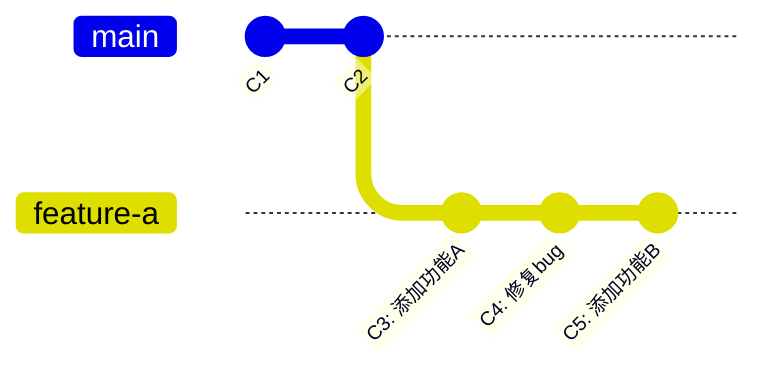

**执行 `git rebase -i dev` 并合并 C3 和 C4 后**：

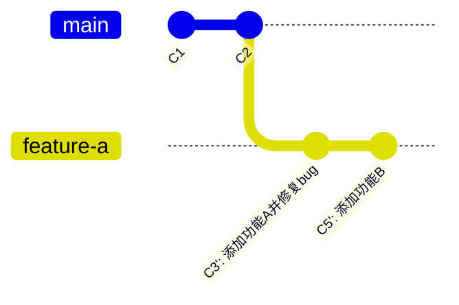

## 禁止使用 Rebase 的场景

**禁止对已共享的公共分支进行 rebase**：

```bash
# ❌ 禁止：如果分支已经推送到远程
$ git rebase main   # 如果 main 是公共分支
```

原因：rebase 会重写提交历史，如果其他人已经基于这些提交工作，会导致严重问题。

## Rebase 规则总结

- ✅ 可以在本地 feature 分支上使用 rebase 整理提交
- ❌ 禁止对已推送的公共分支（`main`、`dev`）进行 rebase
- ❌ 禁止对其他人可能正在使用的分支进行 rebase

---

# 八、Rust 项目特定规范

## 代码格式化

### 使用 cargo fmt

提交代码前，必须运行格式化：

```bash
$ cargo fmt
```

这会自动格式化所有 Rust 代码，确保代码风格一致。

### 设置 Pre-commit Hook（可选）

可以在 `.git/hooks/pre-commit` 中添加格式化检查：

```bash
#!/bin/sh
cargo fmt -- --check
if [ $? -ne 0 ]; then
  echo "Format check failed. Please run 'cargo fmt' first."
  exit 1
fi
```

赋予执行权限：

```bash
$ chmod +x .git/hooks/pre-commit
```

## Clippy 静态检查

提交代码前，运行 Clippy 检查：

```bash
$ cargo clippy -- -D warnings
```

`-D warnings` 表示将所有警告视为错误，确保代码质量。

> 建议在 CI/CD 中配置自动检查。

## Unsafe 使用规范

### 规则

- **所有 `unsafe` 块必须写注释说明安全前提**
- **禁止在 PR 中新增无说明的 `unsafe`**

### 示例

```rust
// SAFETY: The pointer is valid because it comes from a static memory region
// that is guaranteed to be initialized before this function is called.
unsafe {
    *ptr = 42;
}
```

### PR 中的要求

如果 PR 中包含 `unsafe` 代码，必须在 PR 描述中说明：
- 为什么需要使用 `unsafe`
- 如何保证安全性
- 可能的风险

---

# 九、Issue 驱动开发

## 开发流程

所有开发工作都应该基于 Issue：

1. **创建 Issue**：描述问题、标明模块、指定负责人
2. **开发代码**：基于 Issue 进行开发
3. **提交关联**：提交时在 commit message 中关联 Issue
4. **关闭 Issue**：PR 合并后，Issue 会自动关闭（如果 commit message 中包含 `fixes #<issue_number>` 或 `closes #<issue_number>`）

## 创建 Issue

在 GitHub 上创建 Issue 时，应包括：

- **标题**：简洁描述问题或功能
- **描述**：详细说明问题或需求
- **标签**：标记模块（如 `mm`、`trap`、`scheduler`）
- **负责人**：指定处理该 Issue 的开发者

## 提交时关联 Issue

```bash
# 关联 Issue #12
$ git commit -m "[feat/task] add simple executor (#12)"

# 关闭 Issue
$ git commit -m "[fix/mm] resolve memory leak (fixes #15)"
```

---

# 十、同步流程与分支清理

## 每日开发前同步

每天开始开发前，必须同步最新代码：

```bash
# 切换到 dev 分支
$ git switch dev

# 拉取最新代码
$ git pull origin dev
```

## 定期清理无用分支

### 删除本地分支

```bash
# 删除已合并的分支
$ git branch -d feature/xxx

# 强制删除未合并的分支（谨慎使用）
$ git branch -D feature/xxx
```

### 删除远程分支

```bash
# 删除远程分支
$ git push origin --delete feature/xxx
```

## 查看分支状态

```bash
# 查看所有分支（包括远程）
$ git branch -a

# 查看已合并的分支
$ git branch --merged

# 查看未合并的分支
$ git branch --no-merged
```

---

# 十一、代码命名规范（Rust）

## Rust 官方命名规范

Rust 遵循以下命名规范（参考 [Rust API Guidelines](https://rust-lang.github.io/api-guidelines/naming.html)）：

### 变量和函数

使用 **`snake_case`**（小写蛇形命名）：

```rust
let user_name = "Alice";
fn calculate_total() -> i32 { ... }
```

### 类型和结构体

使用 **`PascalCase`**（大驼峰命名）：

```rust
struct UserManager { ... }
enum HttpMethod { ... }
```

### 常量

使用 **`SCREAMING_SNAKE_CASE`**（大写蛇形命名）：

```rust
const MAX_BUFFER_SIZE: usize = 1024;
static API_KEY: &str = "secret";
```

### 模块

使用 **`snake_case`**：

```rust
mod memory_manager;
mod trap_handler;
```

## 命名规范总结

| 类型        | 命名法                  | 示例                              |
|-------------|-------------------------|-----------------------------------|
| 变量/函数   | `snake_case`            | `user_name`, `get_data()`         |
| 类型/结构体 | `PascalCase`            | `UserManager`, `HttpMethod`       |
| 常量        | `SCREAMING_SNAKE_CASE`  | `MAX_SIZE`, `API_KEY`             |
| 模块        | `snake_case`            | `memory_manager`                  |

**重要**：一致性比具体风格更重要，严格遵循 Rust 官方规范。

---

# 十二、代码托管平台（GitHub）

## GitHub 基本操作

### 1. 配置 SSH Key

1. 生成 SSH 密钥：

```bash
$ ssh-keygen -t ed25519 -C "your_email@example.com"
```

2. 复制公钥内容：

```bash
# Windows (PowerShell)
$ cat ~/.ssh/id_ed25519.pub | clip

# Linux/Mac
$ cat ~/.ssh/id_ed25519.pub
```

3. 在 GitHub 上添加 SSH Key：
   - 进入 Settings → SSH and GPG keys
   - 点击 "New SSH key"
   - 粘贴公钥内容

### 2. Fork 仓库

1. 在 GitHub 上找到目标仓库
2. 点击右上角 "Fork" 按钮
3. 选择你的账户，完成 Fork

### 3. 克隆仓库

```bash
# 克隆你 Fork 的仓库
$ git clone git@github.com:your-username/repo-name.git

# 或使用 HTTPS
$ git clone https://github.com/your-username/repo-name.git
```

### 4. 添加上游仓库

```bash
$ cd repo-name
$ git remote add upstream https://github.com/original-owner/repo-name.git
$ git remote -v  # 查看远程仓库配置
```

### 5. 同步上游更新

```bash
# 拉取上游仓库的更新
$ git fetch upstream

# 合并到本地分支
$ git merge upstream/dev
```

---

# 练习题目

1. **Git 基础练习**：
   - 完成 [Learn Git Branching](https://learngitbranching.js.org/?locale=zh_CN) 中"主要"部分的"基础篇"、"高级篇"和"远程"部分的所有关卡，并截图保存。

2. **GitHub 操作练习**：
   - 登录 GitHub，完成 SSH key 的配置
   - 将 [handout-for-wateros](https://github.com/zhitian111/handout-for-wateros) 仓库 fork 到你的账户
   - 克隆你 Fork 的仓库到本地
   - 创建一个新分支（分支名要有意义，如 `feature/test`）
   - 做出任意修改（如修改 README）
   - 使用规范的 commit message 提交（如 `docs: update readme`）
   - 推送到你的远程仓库
   - 创建 Pull Request（从你的分支到原仓库的 `dev` 分支）

3. **编码规范学习**：
   - 阅读项目 GitHub 仓库里的 README.md 文件
   - 查看其中的编码规范部分
   - 确保理解每一项的意思，不明白的地方及时询问

---

# 附录

- [Learn Git Branching](https://learngitbranching.js.org/?locale=zh_CN) - 可视化学习 Git
- [Conventional Commits](https://www.conventionalcommits.org/) - 提交信息规范标准
- [Rust API Guidelines](https://rust-lang.github.io/api-guidelines/) - Rust 编码规范
- [Git 官方文档](https://git-scm.com/doc) - Git 完整文档
